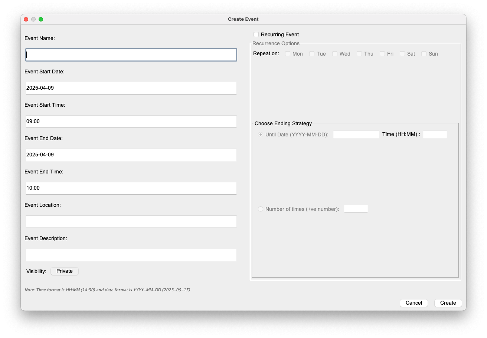

# Calendar App User Guide

## Getting Started

- Double-click on the jar file to start the app
- The current day will be highlighted with the accent color
- An empty calendar displaying the current month and year will appear
- Time zone is displayed below the month and year
- Navigation:
  - 1&2: Month and year dropdown selectors
  - 3: Active calendar dropdown selector
  - 4:  < > buttons to navigate between months and the "Today" button to jump to the current date
  - 5: Access Calendar operations via the 'File' menu

## Managing Events

### Viewing Events
- Click on any date to open the event view
- Events for that date will be displayed in a table (initially empty)

### Creating Events
1. Click the "Add Event" button in the bottom right corner
2. Fill in the event details:
   - Name and other fields
   - Date and time (prefilled with selected date, 9:00-10:00 AM by default)
3. Click "Create" to add the event

### Creating Recurring Events
1. Click the "Recurring Event" checkbox
2. Select weekdays for the event to repeat
3. Choose an ending strategy:
   - Until Date (format: YYYY-MM-DD HH:MM)
   - After Number of Occurrences (positive number)

### Viewing All Events
- After adding events, they will appear on the calendar
- Click any date to see that day's events

### Editing Events
1. Click the edit button for an event
2. Current event details shown at the top
3. Select property to edit and enter new value
4. Choose an "Apply to" option:
   - Just this occurrence
   - All occurrences (for recurring events)
   - This and following occurrences (for recurring events)

#### Property Format Guidelines
- **Name**: String
- **Start Date Time**: MM/DD/YYYY HH:MM AM/PM
- **End Date Time**: MM/DD/YYYY HH:MM AM/PM
- **Location**: String
- **Description**: String
- **Private**: 'true' or 'false'
- **All Day**: Converts event to all-day event
- **Frequency**: Positive number
- **Until Date Time**: MM/DD/YYYY HH:MM AM/PM
- **Weekdays**: 'MTWTFSU' format (M=Monday, T=Tuesday, etc.)

## Calendar Management

Access calendar operations via the 'File' menu:

### Adding a Calendar
1. Click 'New Calendar'
2. Enter a name
3. Select a timezone from the dropdown

### Importing a Calendar
1. Click 'Import'
2. Select destination calendar (or create new)
3. Choose the CSV file to import

### Exporting a Calendar
1. Click 'Export'
2. Select the calendar to export
3. Enter a filename
4. Choose the save location

